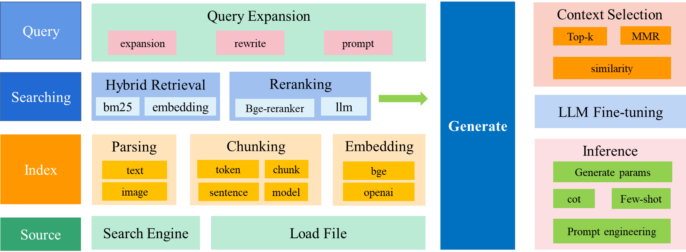

# Tiny RAG

## 1. Introduction

Implement a very small RAG system;

Detailed document: [doc](doc/README.md)

### 1.1 Introduction to RAG

**Retrieval Augmented LLM**, in simple terms,** provides an external database to LLM. For user questions (Query), some information retrieval (IR) technology is used to retrieve information related to the user question from the external database, and then LLM combines these related information to generate results**. The following figure is a simple schematic diagram of retrieval augmented LLM.


Traditional information retrieval tools, such as search engines like Google/Bing, only have retrieval capabilities ( **Retrieval-only** ). Now LLM embeds massive data and knowledge into its huge model parameters through the pre-training process, and has memory capabilities ( **Memory-only** ). From this perspective, retrieval-enhanced LLM is in the middle, combining LLM with traditional information retrieval, and loading relevant information into LLM's working memory ( **Working Memory** ) through some information retrieval techniques, that is, LLM's context window ( **Context Window** ), that is, the maximum text input that LLM can accept in a single generation.

### 1.2 Technical route

- Vectorize the specific text of wiki and baike and store it in the offline vector database;
- Online search of offline database;
- Rearrange the search results and send them to LLM, construct prompt, and LLM outputs the results

### 1.3 Technology used



- Document parsing: supports vectorization of txt, markdown, pdf, word, ppt, images, etc.

- Document embedding: mainly uses bge, and there are online zhipu and openai embedding
- Image embedding: Use clip-vit for image embedding
- Sentence segmentation: supports model and rule segmentation
- Model segmentation: The document semantic segmentation model adopted is nlp_bert_document-segmentation_chinese-base, see the paper https://arxiv.org/abs/2107.09278
- Rule segmentation
- llm: mainly supports qwen2 local calls, and also supports market APIs
- Vector database: Use faiss vector database
- Recall: Implement multi-way recall
- Vector recall: After encoding the sentence bge model, use faiss database to recall top-n
- BM25 recall: Use BM25 algorithm keyword recall
- Rearrangement: Combine the results of multi-way recall and use bge-ranker model for rearrangement

## 2. Project file introduction

Specifically as follows:

```shell
├─data # Folder for storing raw data and vector database
│ ├─db ## Cache database file
│ │ ├─bm_corpus ### BM25 recall cache data
│ │ └─faiss_idx ### Vector recall cache data
│ ├─parser_test
│ └─raw_data ## Original data
├─doc # Related documents
├─models # Model storage folder
│ ├─bge-reranker-base
│ ├─bge-small-zh-v1.5
│ ├─clip-ViT-B-32
│ └─nlp_bert_document-segmentation_chinese-base
├─script # Execution script file
├─test # Test file
└─tinyrag # tinyrag
├─embedding ## embedding
├─llm ## llm
├─parser ## Document parsing
└─searcher ## Search for related documents based on query
├─bm25_recall ### bm25 recall
├─emb_recall ### Vector recall
└─reranker ### Rearrange

```

## 3. Run

The main run script is located in the `script` folder;

### 3.1 Models to download

- [Qwen2 LLM](https://huggingface.co/collections/Qwen/qwen2-6659360b33528ced941e557f)

- [bge-reranker-base](https://huggingface.co/BAAI/bge-reranker-base)

- [bge-small-zh-v1.5](https://huggingface.co/BAAI/bge-base-zh-v1.5)

- [clip-ViT-B-32](https://huggingface.co/sentence-transformers/clip-ViT-B-32)

- [nlp_bert_document-segmentation_chinese-base](https://www.modelscope.cn/models/iic/nlp_bert_document-segmentation_chinese-base)

> Note: For testing, the models are relatively small. If you need to pursue better results, please use a larger model;
>
> Note: If you do not need image vectorization, do not download `clip-ViT-B-32`

### 3.2 Configuration file `RAGConfig`

The configuration file is in the `config` directory, and the detailed configuration class is located in `tinyrag\tiny_rag.py`

`RAGConfig` configuration class

```python
class RAGConfig:
    base_dir:str = "data/wiki_db" # working directory
    llm_model_id:str = "models/tiny_llm_sft_92m" # LLM model
    emb_model_id: str = "models/bge-small-zh-v1.5" # text embedding model
    ranker_model_id:str = "models/bge-reranker-base" # ranking model
    device:str = "cpu" # model running device
    sent_split_model_id:str = "models/nlp_bert_document-segmentation_chinese-base" # sentence segmentation model
    sent_split_use_model:bool = False # sentence segmentation needs to use the model
    sentence_size:int = 256 # maximum sentence length
    model_type: str = "tinyllm" # inference model, supports [qwen2, tinyllm]
```

json configuration file `config\qwen2_config.json`

```json
{
"base_dir": "data/wiki_db",
"llm_model_id": "models/tiny_llm_sft_92m",
"emb_model_id": "models/bge-small-zh-v1.5",
"ranker_model_id": "models/bge-reranker-base",
"device": "cpu",
"sent_split_model_id": "models/nlp_bert_document-segmentation_chinese-base",
"sent_split_use_model": false,
"sentence_size": 256,
"model_type": "qwen2"
}
```

### 3.3 Build an offline database

You need to store doc documents in a list or read them from a file. The specific code is as follows, from `script/tiny_rag.py`

```python
def build_db(config_path, data_path):
    # json_path = "data/raw_data/wikipedia-cn-20230720-filtered.json"
    raw_data_list = read_json_to_list(data_path)
    logger.info("load raw data success! ")
    # Too much data, randomly sample 100 data
    # raw_data_part = random.sample(raw_data_list, 100)

    text_list = [item["completion"] for item in raw_data_list]

    # config_path = "config/build_config.json"
    config = read_json_to_list(config_path)
    rag_config = RAGConfig(**config)
    tiny_rag = TinyRAG(config=rag_config)
    tiny_rag.build(text_list)
```

Run the following command to construct an offline database

```python
python script/tiny_rag.py -t build -c config/qwen2_config.json -p data/raw_data/wikipedia-cn-20230720-filtered.json
```

The offline database will be stored in the configuration file `base_dir` In the directory, there are the following files:

```shell
├─bm_corpus # bm25 offline database search
└─faiss_idx # vector offline database search
    └─index_512
```

### 3.4 Online search

> Note: Make sure that the offline database has been built before

Run the following command to start online database search:

```python
python script/tiny_rag.py -t search -c config/qwen2_config.json
```

Output

```shell
prompt: Reference information:
Currently living in Beijing.
* Beijing: Beijing
Its headquarters is located in Beijing, the capital of China.
The two capitals coexist, Beijing is the capital, and Nanjing is the remaining capital.
The main cities on the plain are Beijing, Tianjin, Shijiazhuang, Xiong'an New Area, etc., among which Beijing is the current capital of the People's Republic of China.
In 1987, the Forbidden City in Beijing was registered as a World Cultural Heritage.
---
My question or instruction:
Please introduce Beijing
---
My answer:
Beijing is the capital of China and a city with a long history and diverse culture. The city has rich historical and cultural heritage and modern urban features, such as the Forbidden City and Tiananmen Square. In addition, Beijing is the center of China's science and technology industry development and has
There are world-class technology companies. If you like history and culture, then you can go to Beijing's Nandelda High-tech Park.
---
Please correct my answer based on the above reference information and my question or instruction. The previous reference information and my answer may be useful or useless. You need to select the most relevant ones from the reference information I gave to provide a basis for your revised answer. The answer must be faithful to the original text, concise but not losing information, and do not make up. You should reply in the language of my question or instruction.
Your revised answer:
output: Beijing is an ancient civilization capital of China. Its architectural history can be traced back to the 4th century BC. The Forbidden City is the Chinese imperial palace during the Ming and Qing dynasties. The Great Wall is one of the world's famous tourist attractions and an outstanding representative of ancient Chinese architecture. The length of these walls is about 40 kilometers and the construction area is about 150,000 square meters. In addition, China has built many palaces and temples, as well as other famous buildings such as the Palace Museum and the Summer Palace.
```

## 4. Development

### 4.1 Vector model

The vector model is located in the `tinyrag/embedding` directory, and currently supports the following embeddings:

- HF embeddings: BGE ...
- IMG embedding: CLIP ...
- openai embedding
- zhipuai embedding

If you want to add other embeddings models, inherit the `BaseEmbedding` class in the `tinyrag/embedding/base_emb.py` file and implement the `get_embedding` method.

`BaseEmbedding` base class, as shown below: 
```python
class BaseEmbedding(ABC):
    """
    Base class for embeddings
    """
    def __init__(self, path: str, is_api: bool) -> None:
        self.path = path
        self.is_api = is_api
        self.name = ""

    @abstractmethod
    def get_embedding(self, text: str) -> List[float]:
        raise NotImplementedError

    @classmethod
    def cosine_similarity(cls, vector1: List[float], vector2: List[float]) -> float:
        """
        calculate cosine similarity between two vectors
        """
        dot_product = np.dot(vector1, vector2)
        magnitude = np.linalg.norm(vector1) * np.linalg.norm(vector2)
        if not magnitude:
            return 0
        return dot_product / magnitude
    @classmethod
    def cosine_similarity2(cls, vector1: List[float], vector2: List[float]) -> float:
        sim = F.cosine_similarity(torch.Tensor(vector1), torch.Tensor(vector2), dim=-1)
        return sim.numpy().tolist()

````

### 4.2 LLM

LLM model implementation is similar to embedding, located in the `tinyrag/llm` directory, currently supports the following llm:

- Qwen
- tinyllm

If you want to add other LLM models, inherit the `BaseLLM` class in the `tinyrag/llm/base_llm.py` file and implement the `generate` method.

`BaseLLM` base class, as shown below:

```python
class BaseLLM(ABC):
    """
    Base class for embeddings
    """
    def __init__(self, model_id_key: str, device:str = "cpu", is_api=False) -> None:
        super().__init__()
        self.model_id_key = model_id_key
        self.device = device
        self.is_api = is_api

    @abstractmethod
    def generate(self, content: str) -> str:
        raise NotImplemented

````

### 4.3 Retrieval module

tiny-rag implements dual-way recall: bm25 recall and vector recall, and implements the rearrangement model. The relevant code is located in the `tinyrag/searcher` directory.

#### (1) Multi-channel recall

The recall module implements dual-channel recall:

- bm25 recall: `tinyrag/searcher/bm25_recall`

- vector recall: `tinyrag/searcher/bm25_recall`

#### (2) Reranking model

The reranking model uses the bge-reranker-m3 model: `tinyrag/searcher/reranker`

#### (3) Overall process

After merging the two-channel recall results, rerank them. Some implementation codes are as follows:

````python
def search(self, query:str, top_n=3) -> list:
    bm25_recall_list = self.bm25_retriever.search(query, 2 * top_n)
    logger.info("bm25 recall text num: {}".format(len(bm25_recall_list)))

    query_emb = self.emb_model.get_embedding(query)
    emb_recall_list = self.emb_retriever.search(query_emb, 2 * top_n)
    logger.info("emb recall text num: {}".format(len(emb_recall_list)))

    recall_unique_text = set()
    for idx, text, score in bm25_recall_list:
        recall_unique_text.add(text)

    for idx, text, score in emb_recall_list:
        recall_unique_text.add(text)

    logger.info("unique recall text num: {}".format(len(recall_unique_text)))

    rerank_result = self.ranker.rank(query, list(recall_unique_text), top_n)

    return rerank_result
````
## 5. References

| Name                                                         | Paper Link                                |
| ------------------------------------------------------------ | ----------------------------------------- |
| When Large Language Models Meet Vector Databases: A Survey   | [paper](http://arxiv.org/abs/2402.01763)  |
| Retrieval-Augmented Generation for Large Language Models: A Survey | [paper](https://arxiv.org/abs/2312.10997) |
| Learning to Filter Context for Retrieval-Augmented Generation | [paper](http://arxiv.org/abs/2311.08377)  |
| In-Context Retrieval-Augmented Language Models               | [paper](https://arxiv.org/abs/2302.00083) |
