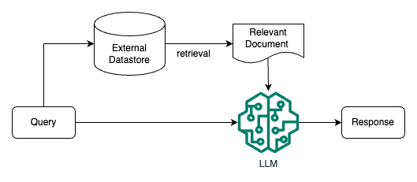

# rag (Retrieval Augmented Generation) Technology

# 1. Basic Concepts

**Retrieval Augmented LLM (Retrieval Augmented LLM)**, in simple terms,** provides an external database to LLM. For user questions (Query), some information retrieval (IR) technologies are used to retrieve information related to the user question from the external database, and then LLM combines these related information to generate results**. The following figure is a simple schematic diagram of Retrieval Augmented LLM.

Traditional information retrieval tools, such as search engines like Google/Bing, only have retrieval capabilities (**Retrieval-only**). Now LLM has memory capabilities (**Memory-only**) by embedding massive data and knowledge into its huge model parameters through the pre-training process. From this perspective, retrieval-enhanced LLM is in the middle, combining LLM with traditional information retrieval, and using some information retrieval techniques to load relevant information into the working memory of LLM, i.e., the context window of LLM, i.e., the maximum text input that LLM can accept in a single generation.

# 2. Problems solved by RAG

> Reference: ACL 2023 Tutorial: Retrieval-based Language Models and Applications

### (1) Long-tail knowledge:

**For some relatively general and popular knowledge, LLM can usually generate relatively accurate results, while for some long-tail knowledge**, the responses generated by LLM are usually unreliable. This paper [Large Language Models Struggle to Learn Long-Tail Knowledge](https://arxiv.org/abs/2211.08411 "Large Language Models Struggle to Learn Long-Tail Knowledge") at the ICML conference studied the relationship between the accuracy of LLM for fact-based question-answering and the number of relevant domain documents in the pre-training data, and found that there is a strong correlation, that is, **the more relevant documents there are in the pre-training data, the higher the accuracy of LLM's response to factual questions**. From this study, we can draw a simple conclusion - \*\* LLM is relatively weak in learning long-tail knowledge\*\*. The following figure is the correlation curve drawn in the paper.

In order to improve LLM's learning ability for long-tail knowledge, it is easy to think of **adding more relevant long-tail knowledge to the training data, or increasing the number of model parameters**. Although these two methods do have certain effects, and the above-mentioned paper also has experimental data support, these two methods are **uneconomical**, that is, a large amount of training data and model parameters are required to significantly improve the accuracy of LLM's response to long-tail knowledge. **Giving relevant information as context during LLM inference through retrieval methods** can not only achieve a better response accuracy, but is also a **relatively economical method**.

### (2) Private data

Most of the pre-training stage of general LLMs such as ChatGPT uses public data, **which does not include private data, so it lacks some private domain knowledge**. For example, if ChatGPT is asked about the relevant knowledge within a certain enterprise, ChatGPT is likely to not know or make up something. Although private data can be added or used for fine-tuning during the pre-training stage, the training and iteration costs are very high. In addition, research and practice have shown that **some specific attack methods can cause LLM to leak training data. If the training data contains some private information, private information leakage is likely to occur**.

**If private data is used as an external database, LLM can directly retrieve relevant information from the external database when answering questions based on private data, and then answer based on the retrieved relevant information**. In this way, there is no need to use pre-training or fine-tuning methods to let LLM remember private knowledge in the parameters, which not only saves training or fine-tuning costs, but also avoids the risk of private data leakage to a certain extent.

### (3) Data freshness

Since the knowledge learned in LLM comes from training data, although the update cycle of most knowledge is not very fast, there will still be some knowledge or information that is updated frequently. **The part of information that LLM learns from pre-training data is easy to become outdated**.

If **the frequently updated knowledge is used as an external database for LLM to retrieve when necessary, it is possible to update and expand LLM knowledge without retraining LLM, thereby solving the problem of LLM data freshness**.

### (4) Source verification and explainability

Usually, the output generated by LLM does not give its source, and it is difficult to explain why it is generated in this way. By providing LLM with an external data source and allowing it to generate based on the retrieved relevant information, a connection is established between the generated results and the information source. Therefore, the generated results can be traced back to the reference source, and the explainability and controllability are greatly enhanced. That is, it is possible to know what relevant information LLM is based on to generate the response.

Using retrieval to enhance the output of LLM, an important step is to find relevant information fragments from external data through some retrieval-related technologies, and then use the relevant information fragments as context for LLM to refer to when generating the response. Some people may say that as the context window (**Context Window**) of LLM becomes longer and longer, the step of retrieving relevant information is no longer necessary, and as much information as possible can be provided directly in the context.

# 3. RAG key modules

In order to build a retrieval-enhanced LLM system, the key modules that need to be implemented and the problems that need to be solved include:

- **Data and index module**: **Convert external data from multiple sources, types and formats into a unified document object** (Document Object) to facilitate the processing and use of subsequent processes. In addition to the original text content, the document object generally carries the document's **Metadata**, **which can be used for later retrieval and filtering**.

- **Query and retrieval module**: How to accurately and efficiently retrieve relevant information

- **Response generation module**: How to use the retrieved relevant information to enhance the output of LLM

# 4. Several RAG call modes

**Mode 1:** Unstructured data is embedded in the vector database through the Embedding Model, and then Construct Prompts are formed and given to LLM. LLM returns the results to the user.

**Mode 2:** The user asks a question, and the next step is to vectorize the question through the Embedding Model, and then save it to the long-term memory database (vector database), and then call LLM to complete the answer to the question, and then store the answer of the large model in the long-term memory database, and finally return it to the user.

**Mode 3:** The user asks a question, and the next step is to vectorize the question through the Embedding Model, and then query similar questions and answers from the Cache (vector database) and return them to the user. If there is no hit, interact with LLM. Then store the answer of LLM in the Cache, and finally return the answer to the user.

These three forms are typical RAG calling modes. It can solve the problem of how to let the large model know different types of data, and at the same time improve performance and efficiency, solve the problem of long-term memory, and greatly improve the hallucination problem.

# 5.RAG vs. SFT

| | RAG | SFT traditional method |
| ----- | ------------------------------------------------------------------ | ----------------------------------------------------- |
| Data | Dynamic data RAG constantly queries external sources, ensuring information remains up to date without frequent model retraining. | (relatively) static data, and can quickly become outdated in dynamic data scenarios. SFT also does not guarantee that this knowledge is remembered. |
| External Knowledge Base | RAG excels at leveraging external sources. It augments LLM capabilities by retrieving relevant information from knowledge sources before generating a response. It is well suited for documents or other structured/unstructured databases. | SFT can fine-tune LLM to align external knowledge learned from pre-training, but may not be practical for frequently changing data sources. |
| Model Customization | RAG focuses primarily on information retrieval and excels at incorporating external knowledge, but may not fully customize the model's behavior or writing style. | SFT allows the LLM's behavior, writing style, or domain-specific knowledge to be adjusted to a specific tone or terminology. |
| Hallucination Mitigation | RAG is inherently less prone to hallucinations because each response is built on retrieved evidence. | SFT can help reduce hallucinations by basing the model on domain-specific training data. But it can still hallucinate when faced with unfamiliar inputs. |
| Transparency | The RAG system provides transparency by breaking down response generation into different stages, providing matching to data retrieval to increase trust in the output. | SFT is like a black box, making the reasoning behind the response more opaque. |
| Related technologies | RAG requires efficient retrieval strategies and large database-related technologies. It is also necessary to keep external data source integration and data updated. | SFT requires preparation and organization of high-quality training datasets, definition of fine-tuning targets, and corresponding computing resources. |

Compared to traditional methods such as pre-training or fine-tuning base models, RAG provides a cost-effective alternative. RAG fundamentally enhances the ability of large language models to directly access specific data when responding to specific prompts. To illustrate the difference between RAG and other methods, please see the figure below. The radar chart specifically compares three different methods: pre-trained large language model, pre-training + fine-tuning LLM, and pre-training + RAG LLM.

