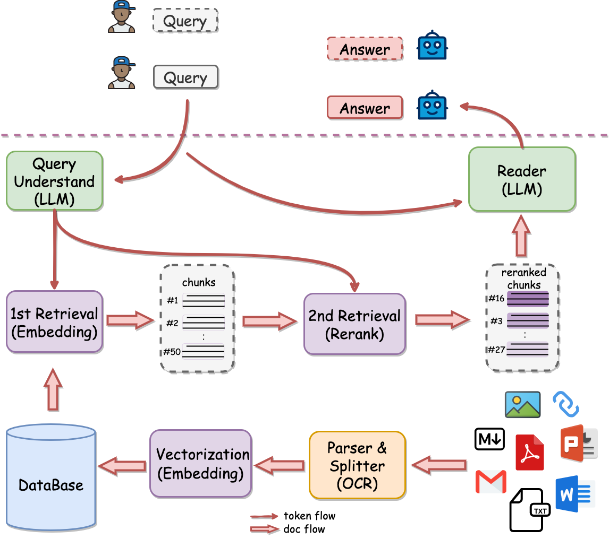
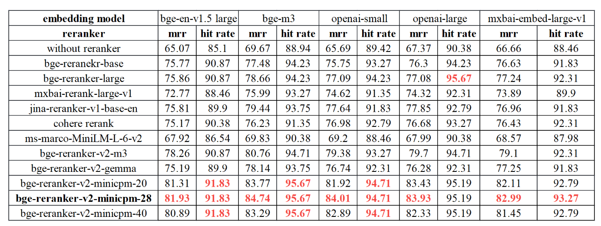

# ReRank vs Embedding&#x20;

> This article is excerpted from: [What is the difference between ReRank and Embedding models? How to choose a ReRank model? \_哔哩哔哩\_bilibili](https://www.bilibili.com/video/BV1r1421R77Y/?share_source=copy_web\&vd_source=a05b2192d4d66ba804ff90f2045d8916 "What is the difference between ReRank and Embedding models? How to choose a ReRank model?_哔哩哔哩_bilibili")

## 1. What is a Rerank model?

The ReRank model is a model that reorders the results returned by RAG retrieval. &#x20;

That is, the model of `2nd Retrieval` in the figure below, which reorders the chunks retrieved by the first step of RAG, that is, the text. &#x20;

The reordered text is then sent to LLM for processing.

> Figure 1: QAnything processing flow chart

## 2. Why do we need a rerank model?

Recall rate and context window problem

- Text embedding vector has information loss, which affects the retrieval accuracy
- The limitation of large model on long text processing ability

By using the rerank model to improve recall, the large model can generate higher quality answers.

For more explanations, please visit: [https://techdiylife.github.io/blog/topic.html?category2=t07\&blogid=0048](https://techdiylife.github.io/blog/topic.html?category2=t07\&blogid=0048 "https://techdiylife.github.io/blog/topic.html?category2=t07\&blogid=0048")

## 3. Why is the rerank model better than the embedding model?

- The loss of information during Embedding processing will affect the accuracy of retrieval
- The Rerank model directly calculates the similarity between user questions and text through the model, which will be more accurate

For more explanations, please visit: [https://techdiylife.github.io/blog/topic.html?category2=t07\&blogid=0048](https://techdiylife.github.io/blog/topic.html?category2=t07\&blogid=0048 "https://techdiylife.github.io/blog/topic.html?category2=t07\&blogid=0048")

## 4. How to choose a Rerank model?

### 4.1 Selection criteria

- Huggingface downloads in the last month
- QAnything experimental comparison results

### 4.2 Downloads (last month)

**Data collection time: 2024.04.18**

| Model | Downloads | |
| -------------------------------------------------------------------------------------------------------------------------------------------------------------------------------------------------------------------------------------------------------- | ------ | ----------- |
| [https://huggingface.co/BAAI/bge-reranker-large](https://huggingface.co/BAAI/bge-reranker-large "https://huggingface.co/BAAI/bge-reranker-large") | 340K | Chinese, English |
| [https://huggingface.co/BAAI/bge-reranker-base](https://huggingface.co/BAAI/bge-reranker-base "https://huggingface.co/BAAI/bge-reranker-base") | 346K | Chinese, English |
| [https://huggingface.co/hotchpotch/japanese-reranker-cross-encoder-xsmall-v1](https://huggingface.co/hotchpotch/japanese-reranker-cross-encoder-xsmall-v1 "https://huggingface.co/hotchpotch/japanese-reranker-cross-encoder-xsmall-v1") | 122K | Japanese |
| [https://huggingface.co/BAAI/bge-reranker-v2-m3](https://huggingface.co/BAAI/bge-reranker-v2-m3 "https://huggingface.co/BAAI/bge-reranker-v2-m3") | 71K | Multi-language, latest version |
| [https://huggingface.co/mixedbread-ai/mxbai-rerank-large-v1](https://huggingface.co/mixedbread-ai/mxbai-rerank-large-v1 "https://huggingface.co/mixedbread-ai/mxbai-rerank-large-v1") | 32K English | |
| [https://huggingface.co/amberoad/bert-multilingual-passage-reranking-msmarco](https://huggingface.co/amberoad/bert-multilingual-passage-reranking-msmarco "https://huggingface.co/amberoad/bert-multilingual-passage-reranking-msmarco") | 22K | Multilingual |
| [https://huggingface.co/mixedbread-ai/mxbai-rerank-base-v1](https://huggingface.co/mixedbread-ai/mxbai-rerank-base-v1 "https://huggingface.co/mixedbread-ai/mxbai-rerank-base-v1") | 16K | English |
| [https://huggingface.co/maidalun1020/bce-reranker-base\_v1](https://huggingface.co/maidalun1020/bce-reranker-base_v1 "https://huggingface.co/maidalun1020/bce-reranker-base_v1") | 15K | Chinese, English, Japanese, Korean |
| [https://huggingface.co/BAAI/bge-reranker-v2-minicpm-layerwise](https://huggingface.co/BAAI/bge-reranker-v2-minicpm-layerwise "https://huggingface.co/BAAI/bge-reranker-v2-minicpm-layerwise") | 5K | Multi-language |

### 4.3 Evaluation of QAnything

**Chinese:**&#x20;

| Model | Reranking | AVG |
| --------------------- | --------- | ----- |
| bce-reranker-base\_v1 | 66.31 | 66.31 |
| bge-reranker-large | 66.01 | 66.01 |
| bge-reranker-base | 63.87 | 63.87 |

**Chinese and English mixed**

| Model | Reranking (12) | AVG (12) |
| --------------------- | -------------- | -------- |
| bce-reranker-base\_v1 | 61.29 | 61.29 |
| bge-reranker-large | 60.86 | 60.86 |
| bge-reranker-base | 59.04 | 59.04 |

Reference link: [https://github.com/netease-youdao/BCEmbedding/blob/master/Docs/EvaluationSummary/reranker\_eval\_summary.md](https://github.com/netease-youdao/BCEmbedding/blob/master/Docs/EvaluationSummary/reranker_eval_summary.md "https://github.com/netease-youdao/BCEmbedding/blob/master/Docs/EvaluationSummary/rerank
er_eval_summary.md")

### 4.4 Best Practices Recommended by BAAI

**BAAI (Beijing Zhiyuan Artificial Intelligence Research Institute) recommends best practices:**&#x20;

- For multilingual, utilize BAAI/bge-reranker-v2-m3 and BAAI/bge-reranker-v2-gemma
- For Chinese or English, utilize BAAI/bge-reranker-v2-m3 and BAAI/bge-reranker-v2-minicpm-layerwise.
- For efficiency, utilize BAAI/bge-reranker-v2-m3 and the low layer of BAAI/ge-reranker-v2-minicpm-layerwise.
- For better performance, recommand BAAI/bge-reranker-v2-minicpm-layerwise and BAAI/bge-reranker-v2-gemma

[https://huggingface.co/BAAI/bge-reranker-v2-minicpm-layerwise](https://huggingface.co/BAAI/bge-reranker-v2-minicpm-layerwise "https://huggingface.co/BAAI/bge-reranker-v2-minicpm-layerwise")

### 4.5 Model recommendation (Chinese, performance priority)

1. [https://huggingface.co/maidalun1020/bce-reranker-base\_v1](https://huggingface.co/maidalun1020/bce-reranker-base_v1 "https://huggingface.co/maidalun1020/bce-reranker-base_v1")
2. [https://huggingface.co/BAAI/bge-reranker-v2-minicpm-layerwise](https://huggingface.co/BAAI/bge-reranker-v2-minicpm-layerwise "https://huggingface.co/BAAI/bge-reranker-v2-minicpm-layerwise")

3. [https://huggingface.co/BAAI/bge-reranker-large](https://huggingface.co/BAAI/bge-reranker-large "https://huggingface.co/BAAI/bge-reranker-large")

**Rerank accuracy evaluation indicators: Hit-Rate, MRR (Mean Reciprocal Rank)**Hit-Rate The correct answer rate of the retrieved text (in Top N) MRR The indicator of the position of the correct text in the retrieval result (the higher the score, the higher the score).

## 5. References:

1. [https://www.llamaindex.ai/blog/boosting-rag-picking-the-best-embedding-reranker-models-42d079022e83](https://www.llamaindex.ai/blog/boosting-rag-picking-the-best-embedding-reranker-models-42d079022e83 "https://www.llamaindex.ai/blog/boosting-rag-picking-the-best-embedding-reranker-models-42d079022e83")
2. [https://github.com/FlagOpen/FlagEmbedding/tree/master](https://github.com/FlagOpen/FlagEmbedding/tree/master "https://github.com/FlagOpen/FlagEmbedding/tree/master")
3. [https://www.pinecone.io/learn/series/rag/rerankers/](https://www.pinecone.io/learn/series/rag/rerankers/ "https://www.pinecone.io/learn/series/rag/rerankers/")
