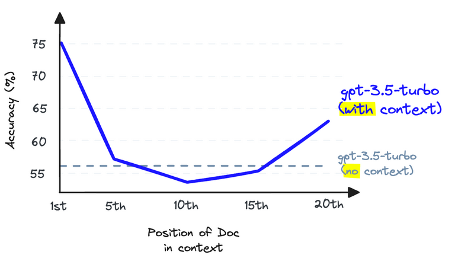
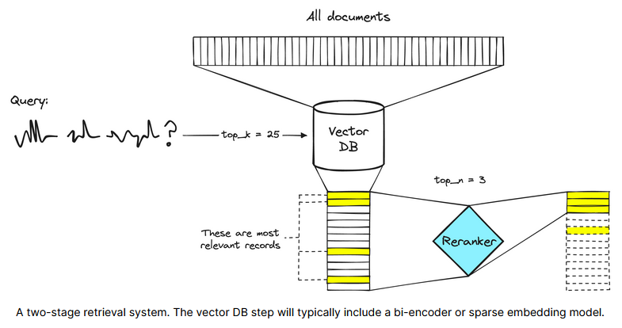
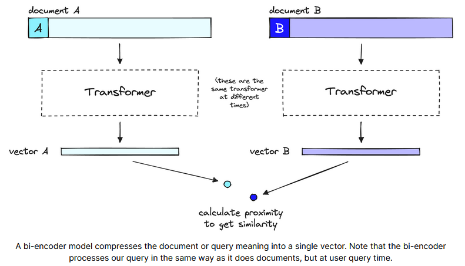
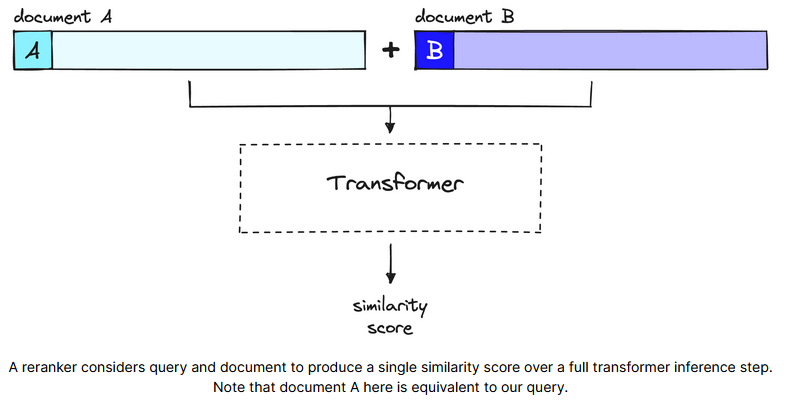

# Two-stage retrieval

> English original: [https://www.pinecone.io/learn/series/rag/rerankers/](https://www.pinecone.io/learn/series/rag/rerankers/ "https://www.pinecone.io/learn/series/rag/rerankers/")

Retrieval Augmented Generation (RAG) seems to be full of possibilities. However, many people often feel that the results are not as expected after building a RAG system. Although RAG is easy to get started, it is quite difficult to really grasp its essence. In fact, building an effective RAG system is not as simple as putting documents into a vector database and stacking a large language model. This approach sometimes works, but it is not a sure thing.

## 1. Recall and context window

Before diving into the solution, let's understand the problem behind it. RAG works by performing semantic search in a large number of text documents, which may reach billions. In order to achieve fast response for large-scale search, vector search technology is generally used, that is, after converting text into vectors, putting them into a vector space, and comparing their proximity to the query vector through metrics such as cosine similarity.

The premise of vector search is that vectors are needed. These vectors basically compress the meaning behind the text into a 768- or 1536-dimensional vector form, and this process inevitably loses some information. Therefore, it is often found that even the top three documents may miss some key information. What if the documents in the lower positions contain relevant information that helps the large language model to better form an answer? A simple way is to increase the number of documents returned (that is, increase the top\_k value) and pass them all to the large language model.

The metric of interest here is **recall**, which is "how many relevant documents did we retrieve". It is worth noting that recall does not take into account the total number of documents retrieved. Therefore, in theory, perfect recall can be achieved by returning all documents. However, this is not feasible in practice because the large language model has certain restrictions on the amount of text that can be processed, called **context window**. Although models such as Anthropic's Claude have huge context windows of up to 100K tokens, which can theoretically include a large number of documents, it is still not possible to return all documents and fill the context window to improve recall.

This is because **when you fill the context window with too much content, you reduce the ability of the large language model to retrieve information in that window**. Research shows that when the context window is filled with too many tokens, the recall of the large language model is affected. In addition, overfilling the context window also makes it more difficult for the model to follow instructions, so this practice is not advisable.

You can improve the recall of retrieval by increasing the number of documents returned by the vector database, but you cannot pass these documents to the model without affecting the recall performance of the large language model.

To solve this problem, **you can maximize the recall of retrieval by retrieving as many documents as possible, and then minimize the number of documents that are finally passed to the large language model**. To do this, re-rank the retrieved documents and keep only the most relevant documents.

## 2. The Power of Reranking Models

A reranking model (also known as a cross-encoder) is a model that outputs a similarity score for a query and document pair. This score is used to rerank the documents according to their relevance to the query.

A retrieval system that consists of two stages. The vector database (vector DB) stage usually includes a bi-encoder (Bi-Encoder) or a sparse embedding model.

Search engineers have long used reranking models in these two-stage retrieval systems. In these systems, the first stage model (an embedding model or retriever) is responsible for extracting a set of relevant documents from a larger dataset. Subsequently, the second stage model (i.e., the reranker) reranks the documents extracted in the first stage.

The two-stage strategy is adopted because it is much faster to retrieve a small number of documents from a large data set than to rerank a large number of documents. The reason for this will be explained shortly, but in short, the reranker is slow and the retriever is fast.

## 3. Why use a reranker?

Given that the reranker is slow, why use it? The key is that the reranker is far more accurate than the embedding model. **

The fundamental reason for the lower accuracy of the bi-encoder is that it must compress all the potential meanings of the document into a single vector - which obviously leads to information loss. In addition, since the query is not known until it is received, the bi-encoder knows nothing about the context of the query (we created the embedding before the user asked the query).

The reranker can process the original information directly in the large Transformer, which greatly reduces the information loss. Since the reranker is run when the user asks the query, it allows us to analyze the meaning of the document for the specific query instead of just generating a generalized, average meaning.

The reranker avoids the information loss problem of the bi-encoder - but it also has a cost, which is time.

The bi-encoder model compresses the meaning of a document or query into a single vector. Note that the dual encoder processes both documents and queries the same way, at user query time.

When using the dual encoder and vector search, all the heavy Transformer computation is done when creating the initial vector. This means that once the user issues a query, the vector is already prepared, and all that needs to be done is:

- Run a Transformer computation to generate the query vector.

- Compare the query vector to the document vector using cosine similarity (or other lightweight metric).

For the reranker, no pre-computation is done. Instead, the query and a document are directly fed into the Transformer, run through a full inference step, and finally generate a similarity score. &#x20;

The reranker generates a similarity score for the query and a single document through a full Transformer inference step. Note that document A here is actually equivalent to our query.

Assuming the system has 40 million records, using a small re-ranking model like BERT running on a V100 GPU may take more than 50 hours to return a query result. With the encoder model and vector search, the same query result can be completed in less than 100 milliseconds.

## 4. Reference documents:

1. N. Liu, K. Lin, J. Hewitt, A. Paranjape, M. Bevilacqua, F. Petroni, P. Liang, Lost in the Middle: How Language Models Use Long Contexts (2023),
2. N. Reimers, I. Gurevych, Sentence-BERT: Sentence Embeddings using Siamese BERT-Networks (2019), UKP-TUDA
